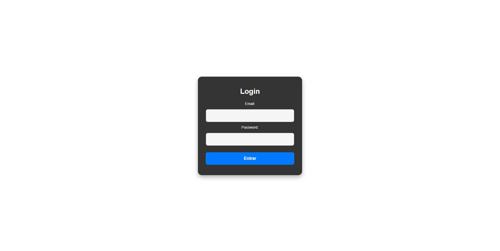
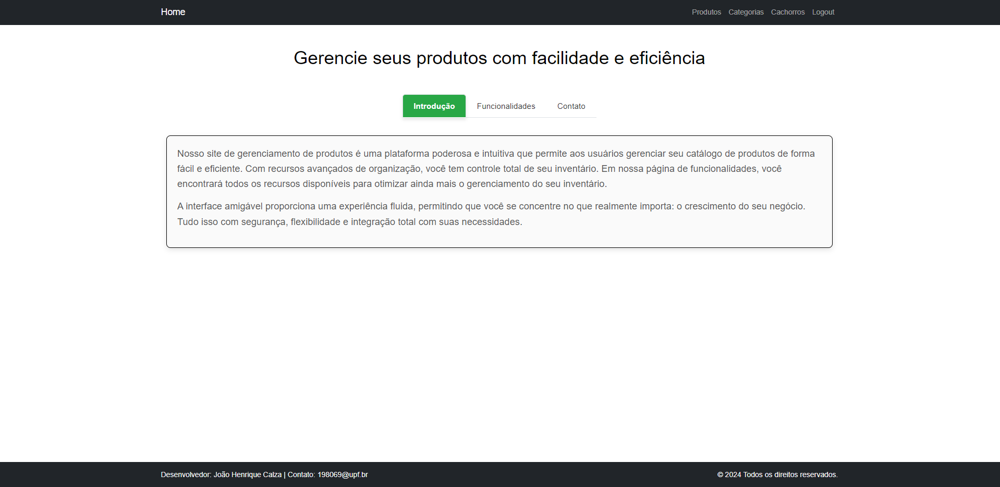
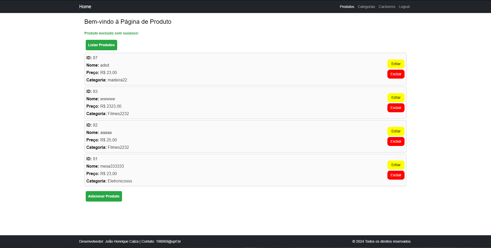
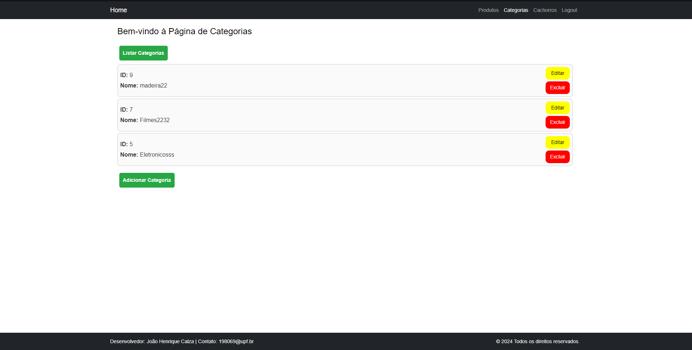

O Gerenciador de Produtos é uma aplicação web que integra backend, frontend e um banco de dados SQL para gerenciar produtos e suas categorias de maneira eficiente.

O projeto inclui autenticação de usuários com JWT, garantindo segurança e controle de acesso.

Características Principais:

🔒 Login Seguro: Sistema de autenticação com JWT para proteger os dados do usuário.

📦 Gerenciamento de Produtos: Cadastro, listagem, edição e exclusão de produtos.

🏷️ Categorias de Produtos: Associar categorias a produtos para uma organização eficiente.

🛠️ Backend: Desenvolvido em TypeScript, com suporte a operações robustas de CRUD.

🌐 Frontend Responsivo: Interface moderna desenvolvida com Next.js e Bootstrap, garantindo uma experiência de usuário fluida.

Tecnologias Utilizadas:

🖥️ Frontend: Next.js, React.js, TypeScript e Bootstrap.

🌐 Backend: TypeScript com Node.js.

⚙️ Configuração do Backend:

Acesse a pasta do backend. 
Configure o arquivo .env com as variáveis necessárias (exemplo: credenciais do banco de dados e secret key do JWT).
- Instale as dependências:
- npm install
- Inicie o servidor:
- npm start
  
💻 Configuração do Frontend:

Acesse a pasta do frontend. 
- Instale as dependências:
- npm install
- Inicie o servidor de desenvolvimento:
- npm run dev

Imagens do Projeto
- **Página de Login**  
  

- **Página Principal**  
  
  
- **Lista de Produtos**  
  

- **Lista de Categorias**  
  

